<a href="https://rhy.io">
  <picture>
    <source media="(prefers-color-scheme: dark)" srcset="./assets/banner-dark.svg" />
    
  </picture>
</a>

  <a href="https://rhy.io/notes">Notes</a> &nbsp;·&nbsp;
  <a href="https://www.linkedin.com/in/rhythmsh">LinkedIn</a> &nbsp;·&nbsp;
  <a href="https://www.facebook.com/rythm.sh">Facebook</a> &nbsp;·&nbsp;
  <a href="https://www.instagram.com/rythm.sh">Instagram</a>

